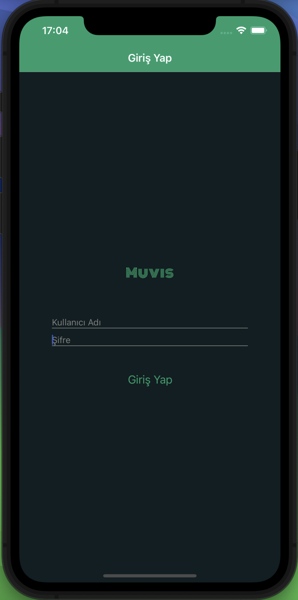
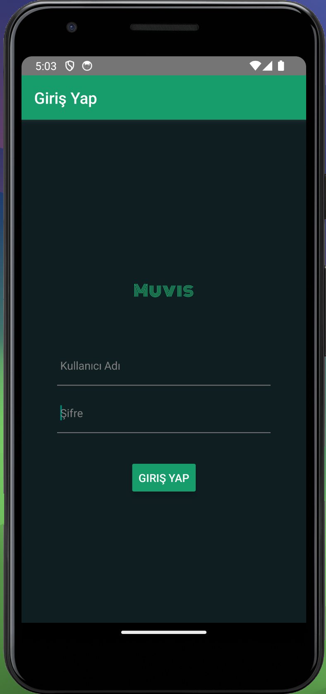

# MUVIS
Muvis is a movie archive collection.

## MODULES
User Module

## TECHNOLOGY USED
React Native, 
React Navigation

## ACTIONS
- Sign In

## OUTPUTS
### Android-iOS Video
- 1.0 https://disk.yandex.com.tr/d/46iacSXjU73MUg
- 1.1 https://disk.yandex.com.tr/d/4nGnyuceBQPB3w
- 1.2 https://disk.yandex.com.tr/i/giFksbgW7VAsAg
- 1.3 https://disk.yandex.com.tr/i/-ClIluEpaRhYBA
- 1.4 https://disk.yandex.com.tr/i/046bcFjBxAxd6g
- 1.5 https://disk.yandex.com.tr/i/QmKmg2q8f5Ypkw
- 1.6 https://disk.yandex.com.tr/d/HaLnC0U7Z4-dQg

### For iOS

### For Android

## EXPLANATION
The user can navigate to the home page by entering a username and password. However, if the user leaves the username or password empty, they cannot proceed to the home page. Once on the home page, the username is visible.