# MUVIS
Muvis is a movie archive collection.

## OUTPUTS
### Old Versions
- 1.0 https://disk.yandex.com.tr/d/46iacSXjU73MUg
- 1.1 https://disk.yandex.com.tr/d/4nGnyuceBQPB3w
- 1.2 https://disk.yandex.com.tr/i/giFksbgW7VAsAg
- 1.3 https://disk.yandex.com.tr/i/-ClIluEpaRhYBA
- 1.4 https://disk.yandex.com.tr/i/046bcFjBxAxd6g
- 1.5 https://disk.yandex.com.tr/i/QmKmg2q8f5Ypkw
- 1.6 https://disk.yandex.com.tr/d/HaLnC0U7Z4-dQg
- 1.7 https://disk.yandex.com.tr/i/3LYy2Pjs_hdnSA

### Outputs
### Outputs

    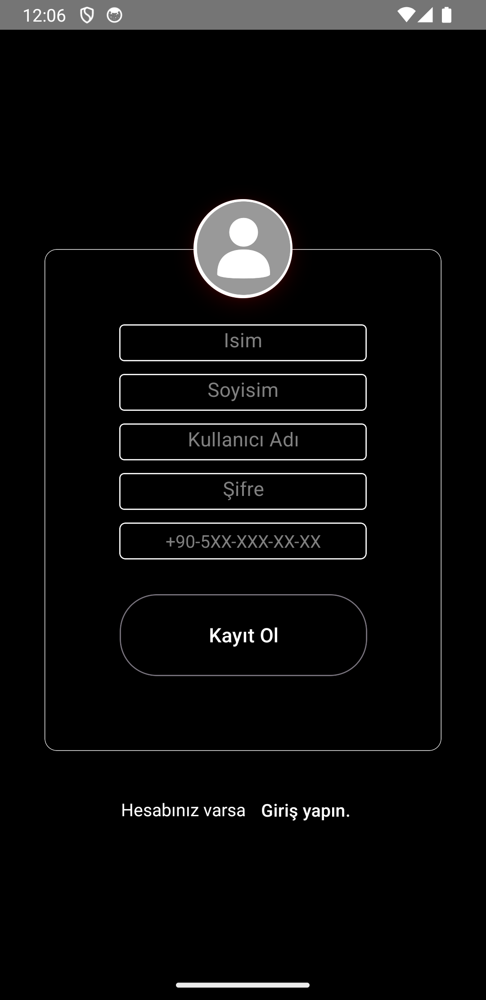
    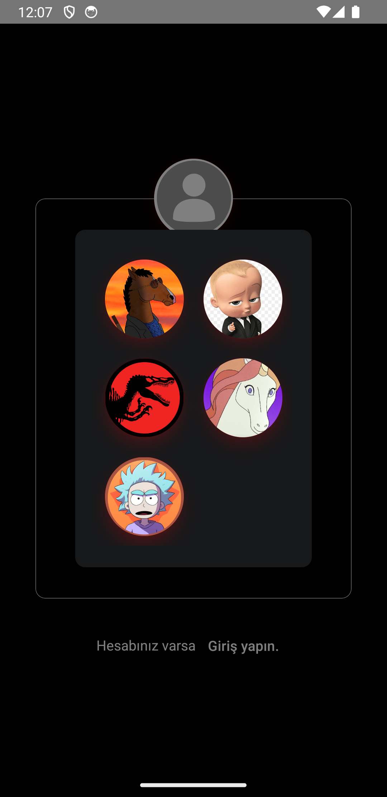
    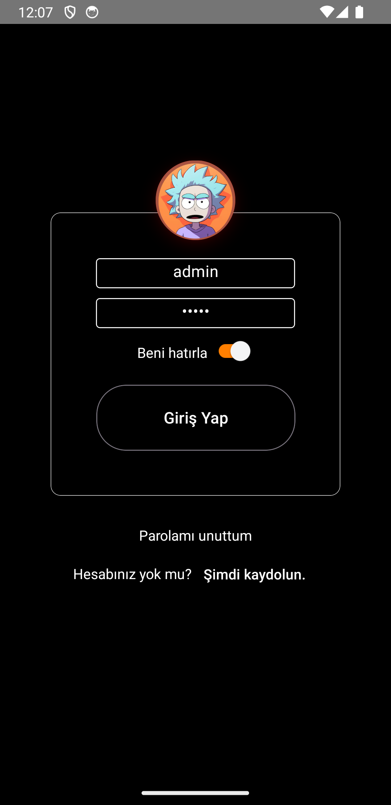
    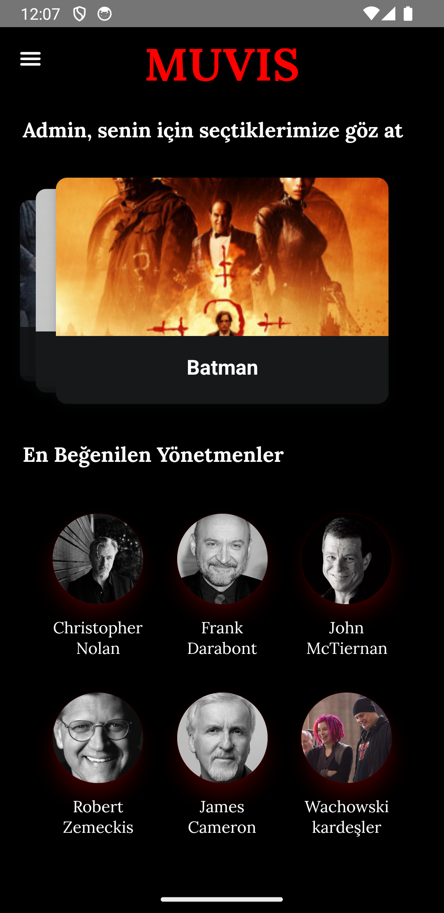
    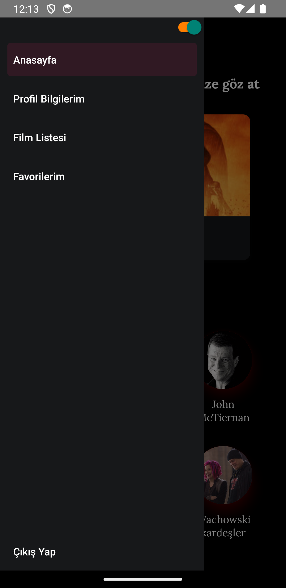
    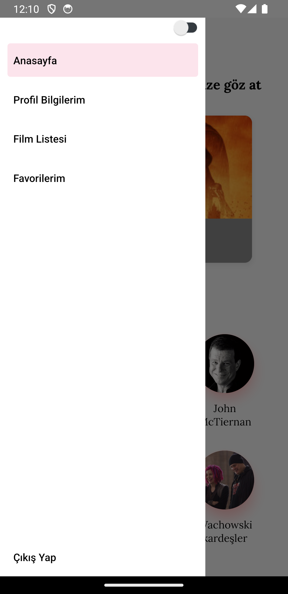
    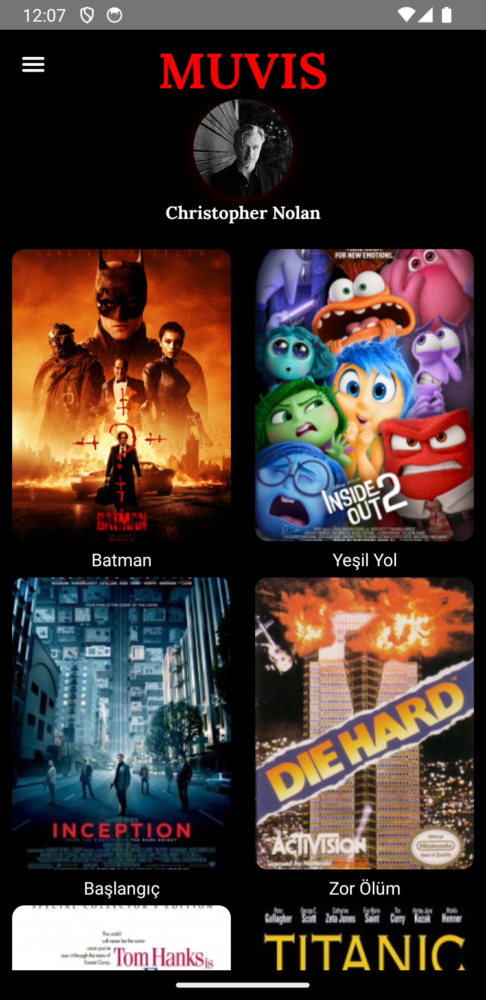
    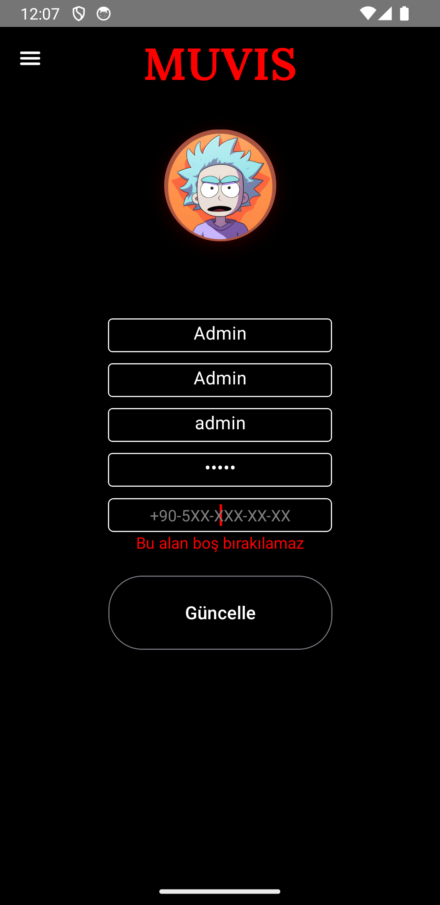
    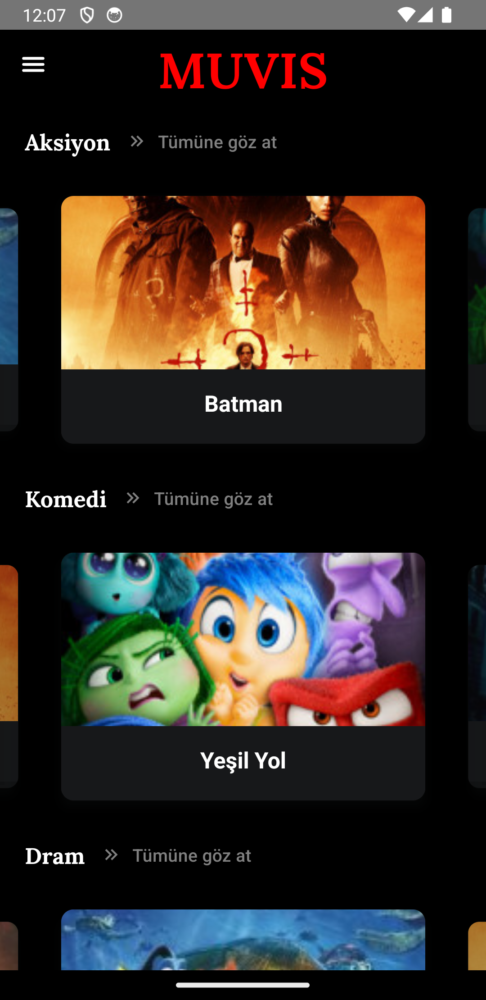
    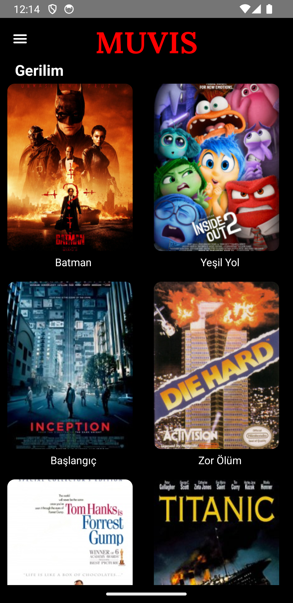
    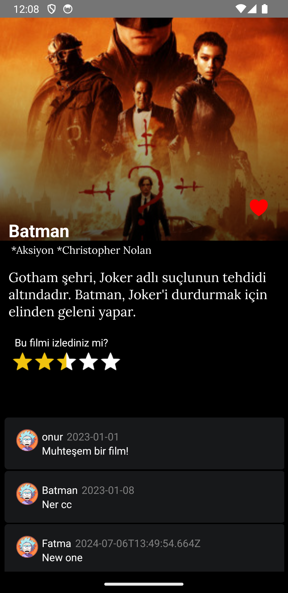
    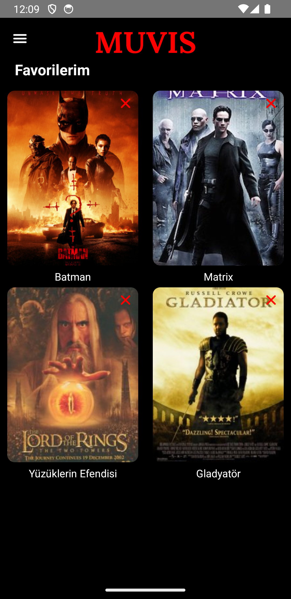

### Summary
- Users can register.
- Users can log in.
- The homepage displays 3 recommended movies.
- Users can view the movies of a director.
- There are light and dark theme options.
- Users can update their information from the profile screen.
- The Movie List screen displays a list of categories.
- Movies belonging to a category can be viewed.
- On the Movie Detail screen, users can add the movie to favorites, view comments, and write comments.
- On the Favorites screen, users can view or delete their favorite movies.

